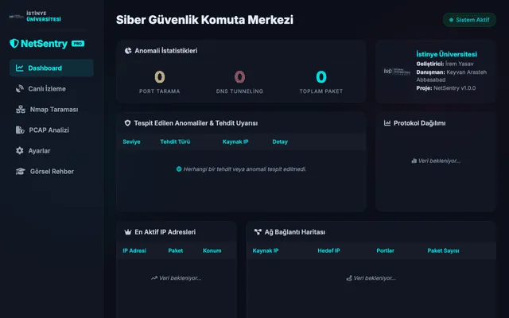

<p align="center">
  
</p>

# 🛡️ NetScanner: Gelişmiş Ağ Trafiği ve Güvenlik Analiz Platformu

   

### 🎬 Sistem Demosu


**Üniversite Adı:** İstinye Üniversitesi  
**Danışman/Eğitmen:** Keyvan Arasteh Abbasabad  
**Geliştirici:** İrem Yasav

NetScanner; ağ trafiğini derinlemesine analiz eden, PCAP dosyalarını okuyarak anormallik tespiti yapan ve Nmap entegrasyonu ile güvenlik açıklarını tespit eden modüler bir ağ güvenlik aracıdır. Proje, hem canlı ağ izleme hem de geçmiş trafik verilerinin detaylı istatistiksel raporlamasını sunar.

---

## 📑 İçindekiler
- [Özellikler](#-özellikler)
- [Proje Mimarisi](#-proje-mimarisi-modüler-yapı)
- [Kurulum](#️-kurulum)
- [Kullanım](#-kullanım)
- [Docker ile Kullanım](#-docker-ile-kullanım)
- [Katkıda Bulunma](#-katkıda-bulunma)
- [Lisans](#-lisans)

---

## 🚀 Özellikler

* 🌐 **Web Dashboard (Yeni!):** Modern, koyu temalı ve Glassmorphism tasarımlı, FastAPI ve WebSocket destekli gelişmiş kontrol paneli.
* 📦 **PCAP Analizi:** Ağ trafik dosyalarını (.pcap, .pcapng) okuma, ayrıştırma ve istatistiksel analiz (Artık Arayüzden Yüklenebilir).
* 📡 **Canlı Trafik İzleme (Sniffing):** Ağ arayüzleri üzerinden gerçek zamanlı IPv4 ve IPv6 paket yakalama ve analiz etme.
* 🛡️ **Nmap Entegrasyonu:** Hedef sistemler üzerinde detaylı port tarama, servis tespiti ve zafiyet analizi (Web Arayüzü Tetiklemeli).
* 📊 **Protokol Analizi:** HTTP/HTTPS isteklerinin tespiti, DNS anormallikleri (örn. DNS tunneling) ve GeoIP destekli IP istatistikleri.
* 🧠 **Anormallik ve Zafiyet Tespiti:** SYN Flood, Port Tarama, Veri Sızdırma (Exfiltration) ve şüpheli payload tespiti.
* 📂 **Otomatik Raporlama:** JSON, HTML ve TXT formatında modüler merkezi arşivleme.

---

## 📂 Proje Mimarisi (Modüler Yapı)

Proje, sürdürülebilir kod prensiplerine uygun olarak Katmanlı Mimari (Layered Architecture) ile geliştirilmiştir:

| Klasör/Dosya Adı | Görev |
| :--- | :--- |
| **`main.py`**          | CLI arayüzü ve merkezi uygulama girişi. |
| **`core/`**            | Uygulamanın temel çekirdek fonksiyonları, yapılandırma ve log yönetimi. |
| **`modules/`**         | Özelleşmiş alt modüller. |
| ├── **`packet_engine/`**| PCAP okuyucu ve canlı trafik dinleme (sniffer) bileşenleri. |
| └── **`nmap_integration/`** | Nmap araçları ile entegrasyon ve tarama yetenekleri. |
| **`reports/`**         | Tarama ve analiz sonuçlarını raporlama mekanizması. |
| **`utils/`**           | Yardımcı fonksiyonlar ve araçlar. |
| **`requirements.txt`** | Python paket bağımlılıkları. |
| **`Dockerfile`**       | Uygulamanın konteyner mimarisi yapılandırması. |

---

## 🛠️ Kurulum

### Gereksinimler
Sisteminizde canlı paket analizi için **Npcap/WinPcap** (Windows) veya **libpcap** (Linux/Mac) kurulu olmalıdır.
Ayrıca **Nmap**'in kurulu olması gerekmektedir:
- **Debian / Ubuntu:** `sudo apt install nmap libpcap-dev`
- **MacOS:** `brew install nmap`
- **Windows:** [Nmap resmi sitesinden](https://nmap.org/download.html#windows) indirerek kurulumu tamamlayabilirsiniz.

### Adımlar

1. Proje dosyalarını bilgisayarınıza indirin ve dizine girin.
2. Gerekli Python kütüphanelerini (örn. `scapy`, `python-nmap`) yükleyin:
   ```bash
   pip3 install -r requirements.txt
   ```

---

## 💻 Kullanım

Uygulamayı başlatmak için ana modülü (`main.py`) **yönetici/root haklarıyla** (paket yakalama yetkisi için) çalıştırın:

```bash
sudo python3 main.py
```

Uygulama size interaktif bir menü sunacaktır. İlgili adımları takip ederek canlı ağ dinleme, PCAP analizi veya Nmap taramalarınızı başlatabilirsiniz.

---

## 🐳 Docker ile Kullanım

Uygulamayı izole bir konteyner ortamında çalıştırmak için (paket yakalama özelliklerinin Docker içinde çalışabilmesi için `--network host` yetkilerine dikkat edilmelidir):

1. Docker imajını oluşturun:
   ```bash
   docker-compose build
   ```

2. Taramayı başlatın:
   ```bash
   docker-compose up
   ```

---

## 🤝 Katkıda Bulunma

1. Bu depoyu fork'layın.
2. Yeni bir özellik dalı oluşturun (`git checkout -b feature/YeniOzellik`).
3. Değişikliklerinizi commit'leyin (`git commit -am 'Yeni özellik eklendi'`).
4. Dalınıza push yapın (`git push origin feature/YeniOzellik`).
5. Bir Pull Request açarak projeye katkıda bulunun.

---

## 📜 Lisans

Bu proje **MIT Lisansı** ile lisanslanmıştır. Detaylar için `LICENSE` dosyasına göz atabilirsiniz.
