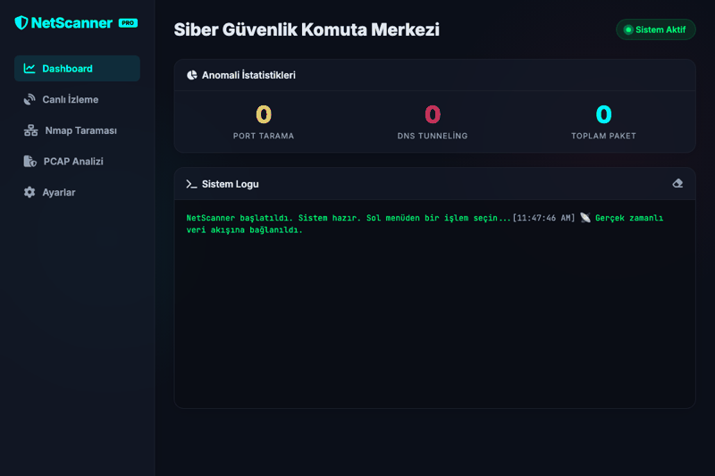

<div align="center">
  <a href="https://istinye.edu.tr">
    
  </a>

  # NetSentry: Gelişmiş Ağ Trafiği ve Güvenlik Analiz Platformu

  [](https://github.com/iremysv/NetScanner)
  [](https://github.com/iremysv/NetScanner)
  [](https://github.com/iremysv/NetScanner)
  [](https://github.com/iremysv/NetScanner)
</div>

---

### Danışman Bilgisi (sabit — değiştirmeyin)

| Ad Soyad | Keyvan Arasteh |
| :--- | :--- |
| **GitHub** | [@keyvanarasteh](https://github.com/keyvanarasteh) |
| **E-posta** | [keyvan.arasteh@istinye.edu.tr](mailto:keyvan.arasteh@istinye.edu.tr) |
| **LinkedIn** | [keyvanarasteh](https://linkedin.com/in/keyvanarasteh) |
| **Web Sitesi** | [qline.tech](https://qline.tech) |

### Öğrenci Bilgisi

| Ad Soyad | İremnur Yasav |
| :--- | :--- |
| **Öğrenci No** | 2520****1019 |

### Ders Bilgileri

| Ders Adı | Sızma Testi |
| :--- | :--- |
| **Ders Kodu** | BGT006 |
| **Kredi** | 3 AKTS |
| **Ön Koşullar** | Ağ Temelleri, Linux CLI |
| **Dönem** | 2025-2026 Bahar |

---

### 🖥️ Sistem Kontrol Paneli (Web Dashboard)



NetSentry (NetScanner), ağ trafiğini derinlemesine analiz eden, Scapy tabanlı paket analiz motoruyla anomali tespiti yapan, Nmap entegrasyonu ile aktif zafiyet taramaları koşturan ve OWASP API Top 10 ile kimlik denetimi politikalarını test eden kapsamlı, modüler bir ağ güvenlik platformudur. Sistem, hem komut satırı (CLI) hem de gerçek zamanlı WebSocket destekli modern bir Web Dashboard (FastAPI) sunmaktadır.

---

## 📑 İçindekiler
- [Gelişmiş Final Modülleri](#-gelişmiş-final-modülleri)
- [Özellikler](#-özellikler)
- [Proje Mimarisi](#-proje-mimarisi)
- [Görsel Eğitim ve Rehberler](#-görsel-eğitim-ve-rehberler)
- [Kurulum ve Gereksinimler](#️-kurulum-ve-gereksinimler)
- [Kullanım Kılavuzu](#-kullanım-kılavuzu)
- [Test ve Kalite Güvencesi](#-test-ve-kalite-güvencesi)
- [Lisans](#-lisans)

---

## 🎓 Gelişmiş Final Modülleri

Vize sürümündeki ağ trafiği analiz motoru ve Nmap entegrasyonuna ek olarak, aşağıdaki **4 ana güvenlik modülü** geliştirilmiştir:

| Modül | Görevi | Tespit Kapsamı |
|:---|:---|:---|
| **Full Vulnerability Scanner** | Otomatik Tarama Zinciri | Nmap Port Tarama ➔ NSE Zafiyet ➔ PCAP Trafik Analizi ➔ API Güvenliği ➔ Credential Testi. Sonuçları tek bir Markdown raporunda birleştirir. |
| **API Security Scanner** | OWASP API Top 10 Değerlendirmesi | OpenAPI/Swagger parser, BOLA (IDOR) yetkilendirme açığı tespiti, yetkisiz erişim, aşırı veri ifşası ve rate limit testi. |
| **Credential Tester** | Giriş Güvenlik Test Cihazı | Brute-force koruması testi, 429 Too Many Requests rate-limiting doğrulaması, hesap kilitleme (lockout) ve zayıf parola tespiti. |
| **Traffic Packet Engine** | Gelişmiş Tehdit Algılama | SYN Flood DDoS saldırıları, Port Tarama kalıpları, DNS Tünelleme (DNS Tunneling) ve DNS DPI anomalileri. |

### CLI Kullanım Örnekleri

```bash
# 1. Otomatik Zincir Taraması (Full Vulnerability Scan)
sudo python3 main.py --full-scan 192.168.1.1 --pcap trafik.pcap --api-base-url http://192.168.1.1/api --login-url http://192.168.1.1/login

# 2. OpenAPI Spec ile API Zafiyet Taraması
python3 main.py --api-scan http://hedef-sunucu/api --openapi-url http://hedef-sunucu/openapi.json

# 3. Kimlik Doğrulama Güvenlik Denetimi
python3 main.py --credential-test http://hedef-sunucu/login
```

---

## 🚀 Özellikler

* 🔗 **Otomatik Tarama Zinciri:** Tek komutla tüm aşamaları sırayla çalıştırır, bir aşamadaki hata diğer aşamaları etkilemez ve birleşik bir Markdown sızma testi raporu oluşturur.
* 🛡️ **DPI & Anomali Analizi:** DNS isteklerindeki alt alan adı boyutunu kontrol ederek veri sızdırmasını (Exfiltration) ve tünellemeyi yakalar.
* 🗺️ **Bağlantı Haritası (Connection Map):** Ağ üzerindeki tüm kaynak ve hedef IP'lerin birbirleriyle iletişim kurduğu portları ve paket sıklıklarını listeler.
* 🌐 **GeoIP & OSINT Entegrasyonu:** Harici IP adreslerini otomatik olarak `ip-api.com` üzerinden konumlandırır. Yerel IP'ler analiz edilmeden doğrudan lokal olarak işaretlenir.
* 🧪 **Hata Toleransı (Thread Safety):** Canlı sniffing ve WebSocket veri akışında paylaşılan kaynaklar `threading.Lock` ile korunarak kilitlenme riski engellenmiştir.

---

## 📂 Proje Mimarisi

```
NetScanner/
├── main.py                    # Merkezi uygulama giriş noktası ve CLI yönetimi
├── core/                      # Yapılandırma ve global ayarlar
│   └── config.py              # Anomali eşik değerleri, port güvenlik bilgileri ve dizinler
├── modules/                   # Çekirdek işlevsel modüller
│   ├── packet_engine/         # Canlı paket dinleme (sniffer) ve PCAP okuyucu kütüphaneleri
│   ├── nmap_integration/      # Port keşif, servis algılama ve subprocess Nmap wrapper'ı
│   ├── api_scanner/           # OWASP API Top 10 zafiyet tarama mantığı
│   ├── credential_tester/     # Auth endpoint analiz algoritmaları
│   └── vuln_scanner/          # FullVulnerabilityScanner orkestrasyon sınıfı
├── reports/                   # TXT, JSON, HTML ve Markdown formatlarında rapor üreteçleri
├── web/                       # FastAPI Web Dashboard katmanı
│   ├── app.py                 # API rota tanımları ve WebSocket bağlantı yöneticisi
│   ├── static/                # Arayüz tasarımları, JS, CSS ve üniversite logoları
│   └── templates/             # index.html ana şablon dosyası
└── Tests/                     # pytest test senaryoları
```

---

## 🎓 Görsel Eğitim ve Rehberler

Proje kapsamında ağ güvenliği prensiplerini ve analiz mantığını kolayca kavramak için iki kılavuz eklenmiştir:
1. **50 Adımda Ağ Analizi Kılavuzu:** [Docs/simple.md](file:///Users/iremyasav/Desktop/NetScanner/Docs/simple.md) dosyasında ağ katmanlarından anomali tespiti ve savunma mekanizmalarına kadar siber güvenlik temelleri açıklanmıştır.
2. **Görsel Akış Şeması (Infographic):** [Docs/infographic.html](file:///Users/iremyasav/Desktop/NetScanner/Docs/infographic.html) dosyasında renk kodlu kartlarla sistemin ham veriyi nasıl işleyip korunma adımına aktardığı görselleştirilmiştir.

---

## 🛠️ Kurulum ve Gereksinimler

### 1. Sistem Bağımlılıkları
Canlı ağ trafiğini dinlemek ve Nmap taramaları gerçekleştirmek için sisteminizde aşağıdaki araçların bulunması gerekir:
* **Nmap:** Açık port taramaları için
* **libpcap:** Python Scapy kütüphanesinin ağ kartını dinleyebilmesi için

**Kurulum Komutları:**
* **macOS:** `brew install nmap`
* **Linux (Debian/Ubuntu):** `sudo apt install nmap libpcap-dev`
* **Windows:** [Nmap](https://nmap.org/) ve [Npcap](https://npcap.com/) kurucularını indirip çalıştırın.

### 2. Python Kütüphaneleri
Gerekli bağımlılıkları yüklemek için sanal ortamınızda aşağıdaki komutu çalıştırın:
```bash
pip install -r requirements.txt
```

---

## 💻 Kullanım Kılavuzu

### Web Arayüzünü Başlatma
Gelişmiş paneli yerel sunucunuzda çalıştırmak için:
```bash
python main.py --web
```
Ardından tarayıcınızdan **[http://localhost:8000](http://localhost:8000)** adresine giderek sistemi kullanabilirsiniz.

### Canlı Ağ İzleme (CLI)
Canlı sniffing başlatmak için (ağ arayüzüne erişim için yönetici/sudo hakları gerekir):
```bash
sudo python main.py --live
```

---

## 🧪 Test ve Kalite Güvencesi

NetSentry, sürekli entegrasyona (CI) hazır bir şekilde kapsamlı biçimde test edilmiştir.

* **Toplam Başarılı Test:** 175 / 175
* **Kod Kapsamı (Coverage):** %78.20 (Minimum baraj: %70)
* **Linting & Statik Analiz:** Flake8 ve Mypy kontrollerinden sıfır hata ile geçmektedir.

Testleri ve kapsama raporunu çalıştırmak için:
```bash
# Tüm testleri koşturun
pytest

# Detaylı kapsama raporu üretin
pytest --cov
```

---

## 📜 Lisans

Bu proje **MIT Lisansı** kapsamında açık kaynaklı olarak sunulmuştur.
